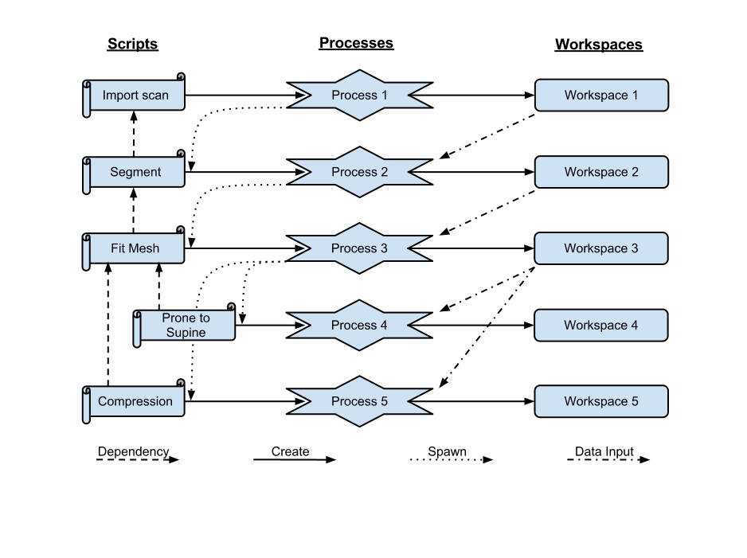

Introduction
============
The Workflow Manager (WM) is a python module that for managing a
data processing project, which consists of scripts, processes and
workspaces. A script describes a how to process data. A process is the
actual execution of a script on data. Workspaces are when data is stored.

One key feature of WM is the ability to create pipelines for processing
data. A pipeline is a sequence of processes acting of data, usually
creating more data. The way WM achieves a pipeline is through script
dependencies (see Figure 1). Scripts can depend on parent scripts. In the
case where there is a dependency, on completion of a parent process the
scripts that depend on the parent process will be executed creating more
processes. If any of these new processes have dependencies, those would
subsequently be executed.

   
   Figure 1. An example of the cascading actions of a WM pipeline.

Figure 1 shows an example of a WM pipeline. The pipeline hinges on the
scripts and their dependencies. In the example above, when the Import
scan script is run it creates and spawns Process 1 which creates
Workspace 1 which stores scan data. On completion of Process 1,
Process 2 is spawned via the Import scan and Segment scripts since the
Segment script depends on the Import scan script. Scan data from
Workspace 1 is used by Process 2 to create data in Workspace 2. The
sequence of action repeat until all the dependent scripts are executed.

Note that if the ``Import Scan`` script is rerun, then a new set of processes
and workspaces are created. However, a process or workspace in an existing
pipeline can be rerun and, if allowed, will rerun subsequent processes.

